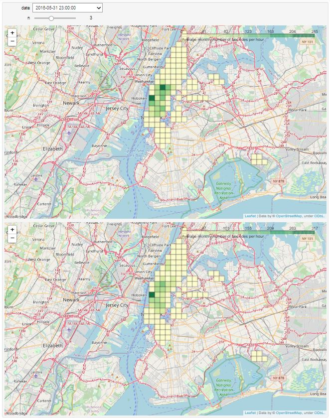
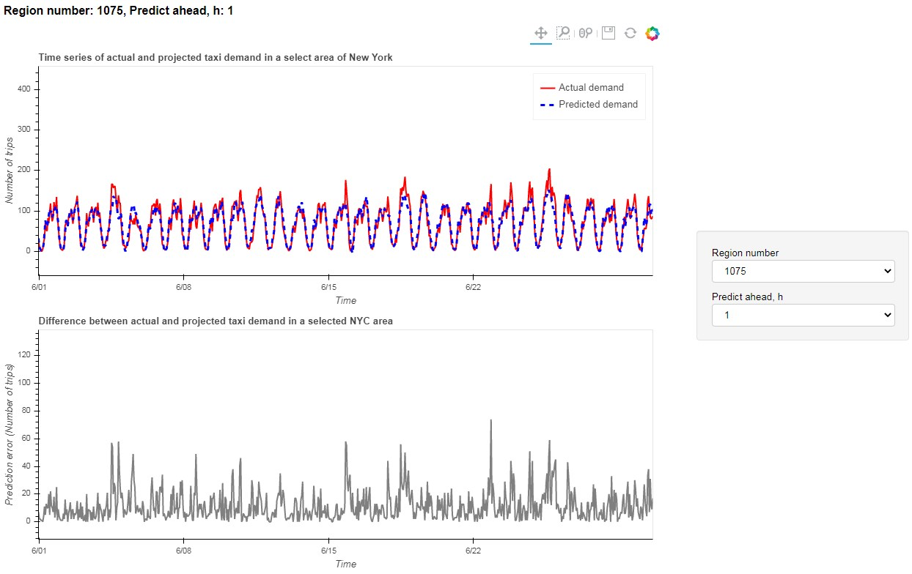

# Project examples

* [Predicting the number of taxi rides in each New York borough in the coming hours](#Taxi_TimeSeries)
* [Predicting the winner in the Dota 2 game](#Dota_predict_win)

---

##  Predicting the number of taxi rides in each New York borough in the coming hours 

The New York Taxi and Limousine Commission (TLC) has been providing detailed, anonymized travel data for customers since 2009. Cars painted yellow have the right to take passengers on the streets at any of the five city bureaus.

The raw data for yellow taxi rides can be found on the [TLC](http://www.nyc.gov/html/tlc/html/about/trip_record_data.shtml).
This data is broken down into files by month. Each file contains the following trip information:
* start time of the trip
* trip end time
* longitude and latitude of the starting point of the trip
* longitude and latitude of the trip end point
* number of passengers
* distance by meter
* tariff type (one of six categories)
* payment method (one of six categories)
* trip cost by meter
* meter tax
* surcharge for travel during peak hours and at night
* surcharge for travel on toll roads
* toll surcharge charged on each trip from January 2015
* tip size
* total cost of the trip
* data provider (one of two categories)
* a binary flag showing whether the trip data was received immediately after its completion, or was stored in the car's memory for some time.

More details can be found [here](http://www.nyc.gov/html/tlc/downloads/pdf/data_dictionary_trip_records_yellow.pdf)
 
**TARGET**
> Learn to predict the number of trips in the coming hours in each borough of New York.

To solve this problem, the raw data is cleaned of errors and anomalies. Further, New York fits into a rectangle from -74.25559 to -73.70001 degrees of longitude and from 40.49612 to 40.91553 latitude. The resulting rectangle is divided into 2500 identical rectangular regions - 50 intervals along each axis.
 

Let's filter out the areas, leaving those of which on average more than 5 trips per hour are made.

Data from the resulting areas are aggregated over time. The aggregated data are hourly time series with the number of trips from each area.
The problem of predicting such series is solved using autoregressive models, predicting each series independently. Since the series have a complex seasonality - daily, weekly and yearly, the ARIMA model with additional regression for external signs is used to model them.
To increase the predictive accuracy of models, additional features are introduced:
* average duration of trips
* average number of passengers
* average distance by meter
* average cost of travel
* total number of trips for the previous half day, day, week
* information about holidays and etc.

More details about the stages of the project can be found at the links:
* [data introduction and aggregation](taxi_NY/week1_Taxi.ipynb)
* [work with geodata](taxi_NY/week2_Taxi.ipynb)
* [forecasting series with complex seasonality](taxi_NY/week3_Taxi.ipynb)
* [forecasting a large number of rows](taxi_NY/week4_Taxi.ipynb)
* [prediction using regression](taxi_NY/week5_Taxi.ipynb)
* [additional signs](taxi_NY/week6_Taxi.ipynb)
* [project design](taxi_NY/week7_Taxi.ipynb)

**RESULTS**

The project results are presented as:
* a map with visualization of real and projected demand for a taxi at a time selected by the user

* time series of actual and projected demand for taxi in a user-selectable area

**CONCLUSIONS**
> * this approach can be applied to tasks where it is necessary to predict the sales of a large number of goods in a large number of stores, the amount of money withdrawn from the ATM network, traffic to different pages of the site, etc 
> 
> During the project:
> * learned to work with geodata and use various libraries, models and tools for data analysis
> * predicted time series of complex structure
> * built and learned how to tune regression models that make joint predictions for a large number of interconnected series

 ---
 
 ---
 
##  Predicting the winner in a Dota 2 game

Dota 2 is a multiplayer computer game of the MOBA genre. Players compete against each other in match mode. Each match involves two teams, 5 people in each. One team plays for the light side (The Radiant), the other for the dark side (The Dire). The goal of each team is to destroy the main building of the enemy base (throne).

There are different game modes, we will be considering Captain's Mode, the format of which most of the Dota 2 esports events take place.
 

 
**TARGET**
> From the first 5 minutes of the game, predict which team will win: Radiant or Dire?

The dataset was made based on the [YASP 3.5 Million Data Dump](http://academictorrents.com/details/5c5deeb6cfe1c944044367d2e7465fd8bd2f4acf) replays of Dota 2 matches from the site [yasp.co](http://yasp.co/).

Using the script, the attributes are extracted from the known information about the match for the first 5 game minutes, and a table is made of them. The table will help you quickly form the object-feature matrix, the response vector and start applying machine learning methods to solve the problem.

The final table includes the following signs
- `match_id`: identifier of the match in the dataset
- `start_time`: match start time (unixtime)
- `lobby_type`: the type of room in which the players gather (decrypted in` dictionaries / lobbies.csv`)
- Sets of attributes for each player (Radiant team players - prefix `rN`, Dire -` dN`):
    - `r1_hero`: player's hero (transcript in dictionaries / heroes.csv)
    - `r1_level`: the maximum achieved level of the hero (for the first 5 game minutes)
    - `r1_xp`: maximum experience gained
    - `r1_gold`: hero value achieved
    - `r1_lh`: the number of killed units
    - `r1_kills`: number of killed players
    - `r1_deaths`: number of hero deaths
    - `r1_items`: number of purchased items
- Signs of the "first blood" event. If the "first blood" event did not have time to occur in the first 5 minutes, then the signs take the missing value
    - `first_blood_time`: game time of first blood
    - `first_blood_team`: team that made the first blood (0 - Radiant, 1 - Dire)
    - `first_blood_player1`: the player involved in the event
    - `first_blood_player2`: the second player involved in the event
- Attributes for each command (prefixes `radiant_` and` dire_`)
    - `radiant_bottle_time`: time of the first purchase of the" bottle "item by the team
    - `radiant_courier_time`: time of purchase of the" courier "item
    - `radiant_flying_courier_time`: the time when the item" flying_courier "was acquired
    - `radiant_tpscroll_count`: the number of" tpscroll "items in the first 5 minutes
    - `radiant_boots_count`: number of" boots "items
    - `radiant_ward_observer_count`: number of items" ward_observer "
    - `radiant_ward_sentry_count`: number of" ward_sentry "items
    - `radiant_first_ward_time`: installation time of the first" observer "by the command, i.e. an object that allows you to see part of the playing field
- Match result (these fields are absent in the test sample, since they contain information that goes beyond the first 5 minutes of the match)
    - `duration`: duration
    - `radiant_win`: 1 if the Radiant team wins, 0 - otherwise
    - Condition of towers and barracks by the end of the match (see description of dataset fields)
        - `tower_status_radiant`
        - `tower_status_dire`
        - `barracks_status_radiant`
        - `barracks_status_dire`

**RESULTS**

Based on the results of applying various machine learning models, we got the following:
* application of gradient boosting with 30 trees gives prediction quality (correct prediction ratio) 0.6895
* application of logical regression gives forecast quality 0.716315
* application of logical regression when adding a "bag of words" for heroes gives a forecast quality of 0.7507

**CONCLUSIONS**
> * this approach can be applied to problems where it is necessary to predict the likelihood of buying a service by a bank client, predicting the likelihood of a client churning to another service provider, etc. 
> 
> During the project:
> * learned how to extract features from raw data and use various libraries and tools for data analysis
> * applied various machine learning models and analyzed how adding features affects forecast quality

---
 