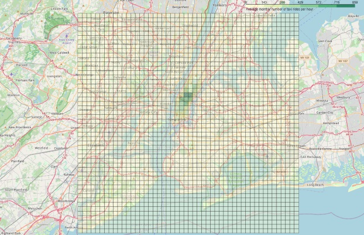
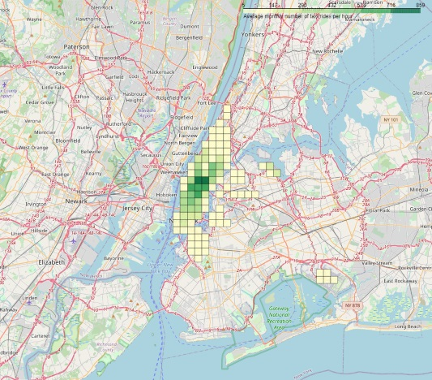

# Примеры проектов

* [Прогнозирование количества поездок такси в каждом районе Нью-Йорка в ближайшие часы](#Taxi_TimeSeries)
* ["DOTA"](#Dota_predict_win)
* [Проект Эйлера](#project_Euler)

---

#  Прогнозирование количества поездок такси в каждом районе Нью-Йорка в ближайшие часы 

Нью-Йоркская комиссия по такси и лимузинам (TLC) предоставляет подробные анонимизированные данные о поездках клиентов с 2009 года. Машины, выкрашенные жёлтым, имеют право брать пассажиров на улицах в любом из пяти боро города.

Сырые данные о поездках в жёлтом такси можно найти на сайте [TLC](http://www.nyc.gov/html/tlc/html/about/trip_record_data.shtml).
Эти данные разбиты на файлы по месяцам. В каждом из файлов содержится следующая информация о поездках:
* время начала поездки
* время окончания поездки
* долгота и широта точки начала поездки
* долгота и широта точки окончания поездки
* количество пассажиров
* расстояние по счётчику
* тип тарифа (одна из шести категорий)
* способ оплаты (одна из шести категорий)
* стоимость поездки по счётчику
* налог на счётчик
* доплата за поездки в пиковые часы и ночью
* доплата за проезд по платным дорогам
* доплата за проезд, взимаемая с каждой поездки с января 2015
* размер чаевых
* общая стоимость поездки
* провайдер данных (одна из двух категорий)
* бинарный флаг, показывающий, были ли данные о поездке получены немедленно после её окончания, или какое-то время хранились в памяти автомобиля.

Подробнее можно узнать [здесь](http://www.nyc.gov/html/tlc/downloads/pdf/data_dictionary_trip_records_yellow.pdf)
 
**ЗАДАЧА**
> Научиться предсказывать количество поездок в ближайшие часы в каждом районе Нью-Йорка.

Для решения этой задачи, сырые данные очищаются от ошибок и аномалий. Далее Нью-Йорк вписывается в прямоугольник от -74.25559 до -73.70001 градусов долготы и от 40.49612 до 40.91553 широты. Получившийся прямоугольник разбивается на 2500 одинаковых прямоугольных районов — по 50 интервалов вдоль каждой оси.
 

Отфильтруем районы, оставив те из которых совершается в среднем более 5 поездок в час.

Данные из получившихся районов агрегируются по времени. Агрегированные данные представляют собой почасовые временные ряды с количествами поездок из каждого района.
Задача прогнозирования таких рядов решается с помощью авторегрессионных моделей, прогнозируя каждый ряд независимо. Так как ряды имеют сложную сезонность — суточную, недельную и годовую, для их моделирования используется модель ARIMA с дополнительной регрессией на внешние признаки.

Для увеличения точности предсказания моделей введены дополнительные признаки:
* средняя длительность поездок
* среднее количество пассажиров
* среднее расстояние по счётчику
* средняя стоимость поездок
* суммарное количество поездок за предшествующие полдня, сутки, неделю
* информация о праздничных днях
* и др.

Подробнее с этапами выполнения проекта можно ознакомиться по ссылкам:
* [знакомство с данными и агрегация](taxi_NY/week1_Taxi.ipynb)
* [работа с геоданными](taxi_NY/week2_Taxi.ipynb)
* [прогнозирование ряда со сложной сезонностью](taxi_NY/week3_Taxi.ipynb)
* [прогнозирование большого количества рядов](taxi_NY/week4_Taxi.ipynb)
* [прогнозирование с помощью регрессии](taxi_NY/week5_Taxi.ipynb)
* [дополнительные признаки](taxi_NY/week6_Taxi.ipynb)
* [оформление проекта](taxi_NY/week7_Taxi.ipynb)

**РЕЗУЛЬТАТЫ**

Результаты проекта представлены в виде:
* карта с визуализацией реального и прогнозируемого спроса на такси в выбираемый пользователем момент времени (можно ознакомится по этой [ссылке]())

* временной ряд фактического и прогнозируемого спроса на такси в выбираемой области (можно ознакомится по этой [ссылке](taxi_NY/data/df_regions/predict_figure.html)

**ИТОГИ**
> В ходе выполнения проекта:
> * научились работать с геоданными и использовать различные библиотеки, модели и средства для анализа данных
> * спрогнозировали временные ряды сложной структуры
> * построили и научились настраивать регрессионные модели, делающие совместные предсказания для большого количества взаимосвязанных рядов
> 
> Применение:
> * данный подход может быть применен к задачам, в которых, например, необходимо спрогнозировать продажи большого количества товаров в большом количестве магазинов, объём снятия денег в сети банкоматов, посещаемость разных страниц сайта и т.д. 
 
 ---
 
#  Прогнозирование победителя
 
 
 ---
 
#  Проект Эйлера
 